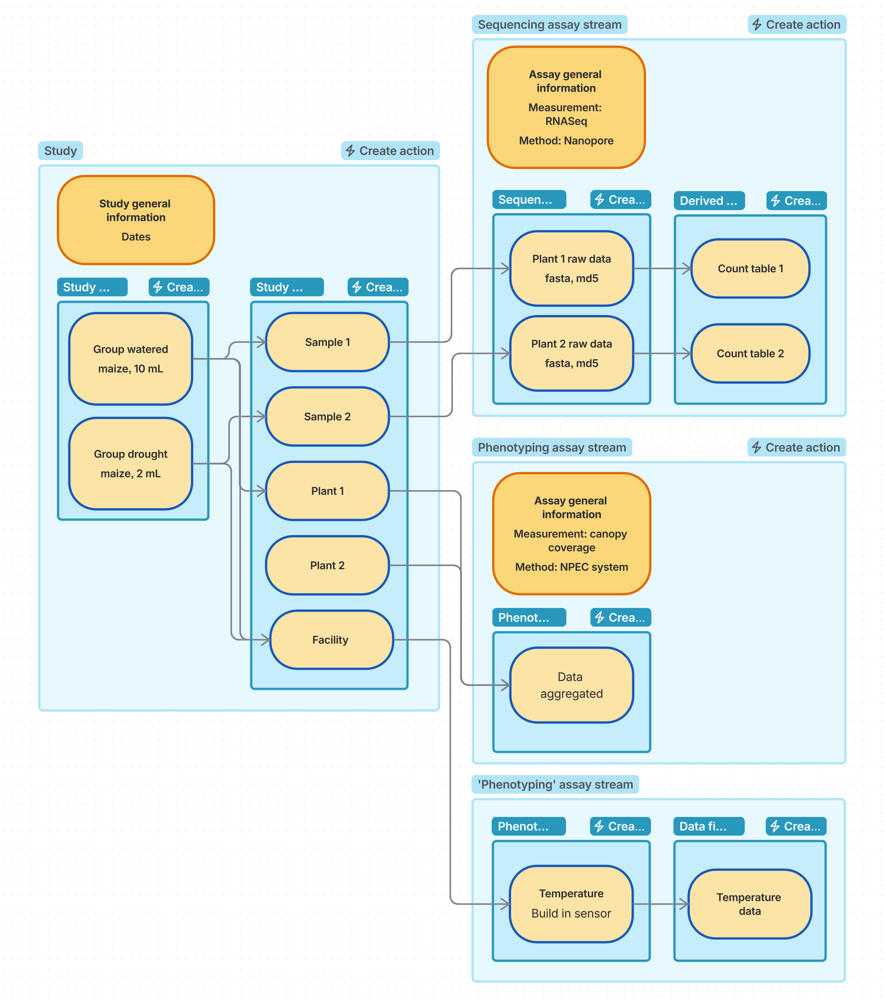
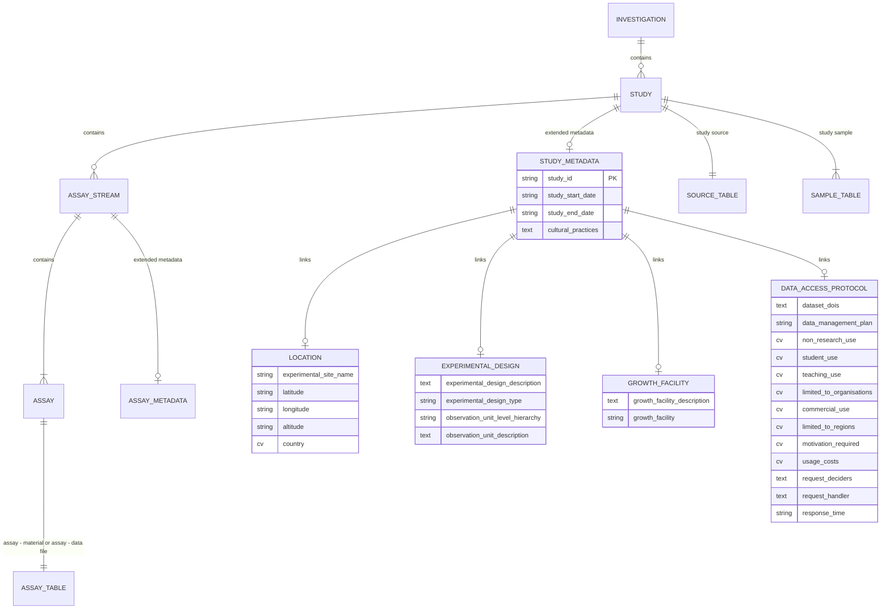
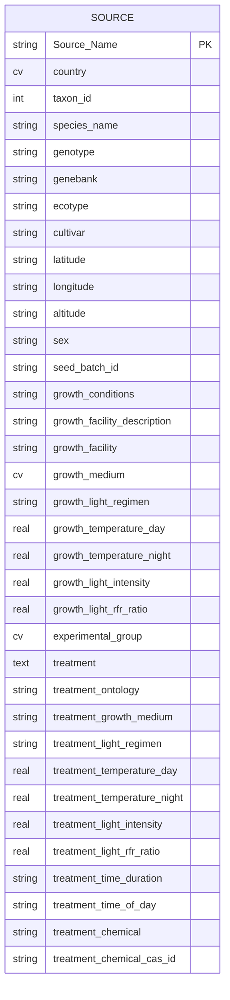
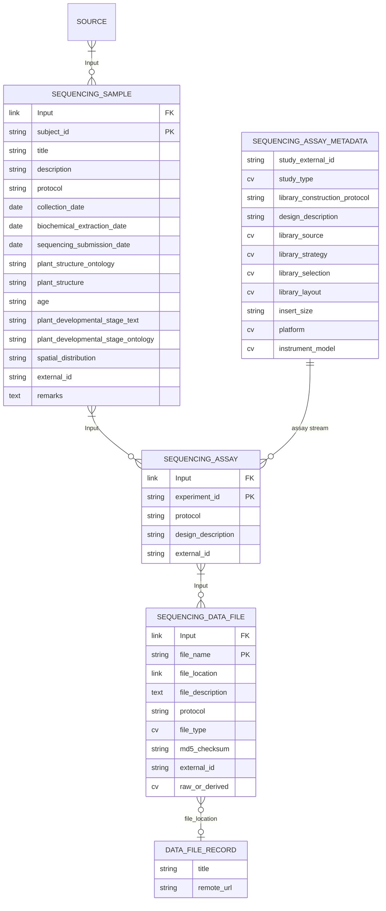
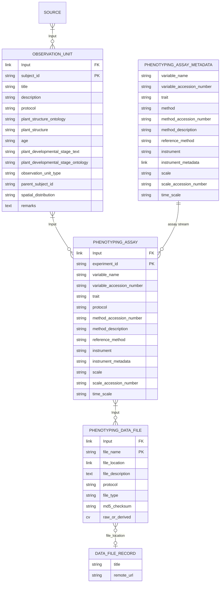
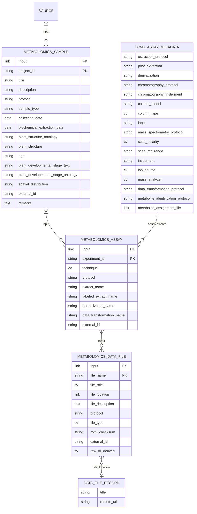
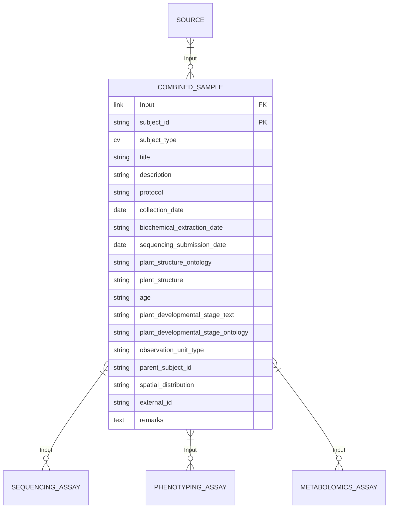

# Introduction Metadata Model

All the research produced in the CropXR consortium will be well annotated with metadata following the CropXR standards. 

The metadata annotation will have multiple uses:

- Findability of your study, by other researchers in the consortium
- Reusability of your data by other users in the consortium
- Improvement of your own data annotation

The responsibility to annotate the data lies with the researcher, with the help and tools provided by DataXR.

#### Model flexibility
A standardized metadata format ensures that the metadata has a predictable structure. 
There are however many different types of studies in the consortium, with different metadata that is important. 
To fit all different studies in the same format there is a certain flexibility in the model.
This puts some responsibility on the researcher for how to use this format and to really understand the model. 
These documents should provide the information needed to make those choices. 
For the first time entering metadata, plan sufficient time to understand the model.
If you are stuck at any point, things are unclear, or you need help, please reach out to the DataXR team at data@cropxr.org

## Standards

The CropXR metadata model is made up from a combination of established standards for metadata on plant research:

- **Phenotyping** [ISA](https://isa-specs.readthedocs.io/en/latest/index.html) + [MIAPPE](link with MIAPPE fields)
- **Sequencing** [ISA](https://isa-specs.readthedocs.io/en/latest/index.html) + [ENA for plants](ENA35) + [ENA for crops](ENA37) + additional fields based on LettuceKnow experience.

MIAPPE and ENA describe in a standardized way, the setup of a study, the experimental conditions, 
the types of measurements performed and how the output data can be related to that, up to sample level.
This detailed standardized description facilitates that the findability and reusability of the data.
Because both standards describe the setup of a plant experimental, there is a large overlap between the standards.
To make the metadata uniform, and to be able to describe combined experiments, the standards have been combined into a unified metadata model.
In this model, you can describe the plants and growth conditions on study level and from there start multiple types of measurements.

The ISA format is widely used to represent research data. It is often used to represent MIAPPE data. 
The catalogue uses the ISA structure, somewhat adapted. This page will explain how the standards fit into the catalogue data model.

### Assay and sample definition

In the ISA format, you can perform assays on samples. It assumes that in an experiment, there are several steps called a process. Each process has an input and an output and a protocol, that describes how the output was created from the input. The input can be either a material or data, and the output as well. These processes can be chained together. Here is an example:
    
    step 1 sample collection (input plant material-> output sample)
    step 2 DNA extraction and library prep (input sample -> output sample) 
    step 3 sequencing (input sample -> output data)
    step 4 analysis (input data -> output data)

In ISA these processes are organized the following way: the study contains 1 process with a material input (study source) to a material output (study sample). 
The other processes, however many needed, are grouped under the assay. The assay can consist of several steps/processes and starts with the study sample.

In the catalogue, the processes that are grouped under the assay, are all called an assay even if the input and output are both a material object, or both data files. 
This does not fit with the classical meaning of the word ‘assay’, but it implements the same functionality as ISA. The assays can be connected into an assay stream.

Each row, that can describe a sample, but also an assay performed on a sample, or a derivation of a data file, is called always a ‘sample’ in the catalogue.

## Entity-relationship diagrams

The diagrams below are drawn from the template definitions (model 1.3.0). Every box is a table in the catalogue, and every row of every table is a "sample" to SEEK. `PK` marks the column SEEK displays as the row's name; it must be unique within the table. `FK` marks the `Input` column, a list of rows from the table one level up. `cv` is a controlled vocabulary, `link` is a reference to a record registered elsewhere in the catalogue. Fields without a marker are optional.

### Containers and study-level metadata

Whole-study and whole-assay properties do not sit in the tables. They sit on the Study and the assay stream as extended metadata, one type per stream. The study types embed nested records for location, experimental design, growth facility and the data access protocol.

The study types are `CropXR phenotyping study`, `CropXR sequencing study`, `CropXR metabolomics study` and `CropXR combined study`. The sequencing study type carries only the study id, the dates and the data access protocol. The assay types are shown in the stream diagrams below.

### The source, shared by every stream

One source row is a genotype or seed batch together with the conditions it was grown under before treatment (`growth_*`) and during treatment (`treatment_*`). Those conditions apply to every sample and file derived from the row, so anything that varies per plant belongs on the sample instead. A source can hold one treatment.

### Sequencing stream

The library fields follow ENA and sit on the assay stream's extended metadata, because they hold for every sample sequenced in that assay. The assay row therefore carries little more than an id and the protocol.

### Phenotyping stream

The study sample is an observation unit: the plant, plot, greenhouse or other level on which a measurement is made. Units can nest through `parent_subject_id`, which is a name and not a checked link. The observed variable, method, instrument and scale can be described once on the assay stream's extended metadata, or per row when they differ between rows.

### Metabolomics stream

One assay row is one extract measured by one technique. The instrument and protocol parameters sit on the assay stream's extended metadata, with one type per technique: `CropXR LC-MS assay`, `CropXR GC-MS assay` or `CropXR NMR assay`. The diagram shows the LC-MS type; GC-MS adds an autosampler model and guard column, NMR replaces the chromatography and mass spectrometry fields with tube, solvent, probe, pulse sequence and field strength.

### Combined sample

A study that holds both physical samples and observation units can use `CropXR combined sample` instead of a stream's own sample template. It carries the union of the sequencing sample and observation unit fields plus a required `subject_type` that says which one a row is.

### What the model cannot express

- A link between rows of different studies.
- A derived file whose inputs come from two assay streams.
- More than one treatment on a source.
- An observation unit hierarchy that the catalogue checks.

Field descriptions and vocabulary terms are listed in the [sample types reference](https://gitlab.ewi.tudelft.nl/reit/dataXR/seek-metadata-definitions) of the metadata definitions repository.

## Sections

### Study extended metadata

Information that is the same for the whole study.

### Study sources
The study sources section describes the plant, the growth conditions, the treatment.

Besides the standard parameters that are suggested, it is possible to include additional parameters.
Use the MIAPPE lists for growth conditions and experimental factors for predictable descriptors of relevant parameters.
Not all conditions are as relevant and need to be included in the metadata.

Choose the granularity that is needed for your metadata. 
The sources are used to specify the biological material, as well as the growth conditions. 
At least each experimental block needs to be defined as a separate source. 
If the metadata and a sample needs to be traced back to a certain plant, you might define a source per plant.

### Study samples

An observation unit is any level on which a measurement/observation  is done. Examples are a plant, plot or whole field or greenhouse.
A sample is a special level: it describes a physical subset of the plant that is collected for analysis. It will contain some information about sampling.

Both samples and observation units are listed under the study samples section.
The units can be nested.

How to define this will depend on the specific design of a study, and typically be the unit for which each experiment generates a file. 
Think about the assays and the data files when defining the observation units.

### Phenotyping assay extended metadata

Each different type of phenotyping measurement will be represented by an assay stream.
The observed variable describes the measurement: what was measured and how, including the instrument. 
It can be used to describe any type of measurement.
This is important, because phenotyping does not rely on a limited set of experiments.
It does require you to describe the measurement in the format.

As more people have started with their metadata annotation, it is likely valuable to create a CropXR internal reference,
where you can find how other people have described similar or the same type of experiments.

In the assay stream extended metadata the information that is the same for each individual measurement can be captured.

### Assay rows

Each row describes a measurement on a sample or observation unit.
Include any info that is different per performed measurement and/or not captured in the assay extended metadata.
Typically include the data file location of the output of a measurement.

### General assay

When multiple measurements are done, each generating only few outputs, 
it is easier to describe these measurements without needing to create a separate assay stream for each.
It is possible to make a general assay that includes multiple measurement types.

In this assay there is no extended metadata on assay stream level.
Each row describes the assay: what was measured and how. 
In a next assay step the data file can be linked to the assay.

### Derived data files

For derived data files a separate assay step can be added. 
The input is an output file from the previous step and the method of data derivation can be included.

## Practical

#### Relevant columns
Not all fields are relevant to each study.

#### Fixed or free fields
Some fields are free text, some you need to pick from a list (controlled vocabulary), some are free, but with a list of suggestions to pick from.

## Outlook
In the future the catalogue will be extended to cover metabolomics data.

The catalogue can be improved with small suggestions based on researcher feedback.

There will be an improved integration with the storage.

There will be a way to export the metadata into an ENA format for easy submission. There will be an importer that can import published ENA metadata into the format of the catalogue. 
