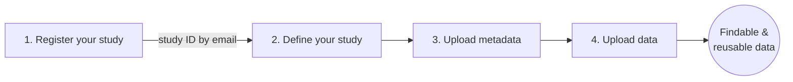

# Getting Started

This page walks you through what you will do as a researcher, in the order that you will usually do it.

## Getting your research data on the Resilience Hub

## What do you want to do?

-   :material-book-open-variant: **Know the metadata models**

    ---

    Understand how studies, samples, assays and data files are described before you start.

    [:octicons-arrow-right-24: Metadata models](../concepts/index.md)

-   :material-clipboard-text-outline: **Define a study**

    ---

    Register your study, get a study ID, and decide what it contains.

    [:octicons-arrow-right-24: Define a study](../concepts/defining-a-study/)

-   :material-table-arrow-up: **Upload metadata**

    ---

    Describe your study, samples and assays in the catalogue.

    [:octicons-arrow-right-24: Upload metadata](../resilience-hub/seek/full-guide.md)

-   :material-cloud-upload-outline: **Upload data**

    ---

    Send your data files with the command line tool.

    [:octicons-arrow-right-24: Upload data](../resilience-hub/cli-tool/index.md)

## Step by step

### 1. Register and define your study

[Register your study](https://forms.cloud.microsoft/Pages/ResponsePage.aspx?id=TVJuCSlpMECM04q0LeCIe9rk7LtjOclKu9pKlmXMf-xUMzVUVFpYVkxZTE9VNTFXTVBMSU1EN1paTC4u). You will receive a study ID by email. This can take some time, so do it early.

While you wait, read up on the [metadata models](../concepts/index.md) so you know what information you will need to collect.

### 2. Upload metadata

Enter your metadata in [the catalogue](../resilience-hub/seek/index.md).

!!! tip "Using the old Excel templates?"
    If you've already filled in your metadata in the old Excel templates, email [data@cropxr.org](mailto:data@cropxr.org) and we will help you upload it.

### 3. Upload data

Upload your data files using our [command line tool](../resilience-hub/cli-tool/index.md).

!!! warning "ResearchDrive uploads are not possible for new studies"
    Use the command line tool instead. Older data remains available on [Research Drive](../research-drive/index.md).

## More help

| If you… | Go to |
|---|---|
| are new to CropXR | [Concepts](../concepts/index.md) |
| need a step-by-step walkthrough | [Guides](../guides/index.md) |
| are looking for older data | [Research Drive](../research-drive/index.md) |
| are sharing sensitive data | [Policies](../policies/index.md) |
| came across an unfamiliar term | [Glossary](glossary.md) |
| are stuck | email [data@cropxr.org](mailto:data@cropxr.org) |