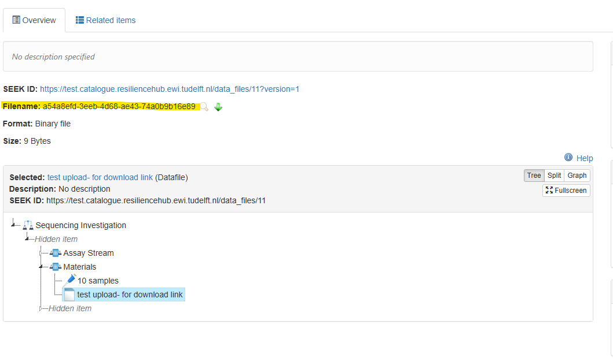

## Download a dataset
You need to first install the tool on your computer. Follow the [installation guide](cli-install.md).

Copy each command from this page into the terminal and press Enter. Some commands hold example values that you replace with your own. The page says which.

You browse datasets in the catalogue. Find the dataset you want to download there and open it.

### Find the identifier of the dataset

On the page of the dataset, stay on the tab "Overview". The line "Filename" holds the identifier of the dataset, a long code of letters, digits and hyphens. It is marked in yellow in the picture.



Copy the identifier.

### Command to download data

```bash
rhub download 3f2504e0-4f89-11d3-9a0c-0305e82c3301 "/path/to/folder"
```

Replace the two example values with your own.

| Example value | Replace it with |
|---|---|
| `3f2504e0-4f89-11d3-9a0c-0305e82c3301` | The identifier of your dataset |
| `/path/to/folder` | The folder on your computer where the data should arrive. Choose a folder that does not exist yet, the tool creates it |

The tool shows you the status.

```
Fetching 3 files, 195.3 KiB.
195.3 KiB / 195.3 KiB (100%), 3 of 3 files, 2.4 MiB/s
Done. The resource is in /path/to/folder.
```

If a download was stopped, run the same command again and add `--merge` at the end. The files that finished are skipped.

## Questions and feedback

Write to the DataXR team at [data@cropxr.org](mailto:data@cropxr.org). Include the output of `rhub --version` and `rhub whoami`, the command you ran, and what the tool printed. Never send a password or a token.