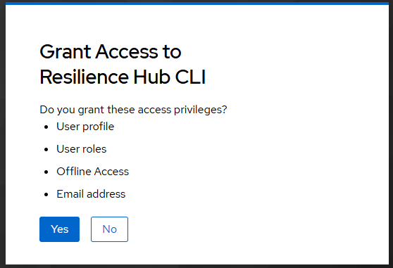

# Install data tool

The data upload and download is done using a command line tool for the Resilience Hub, `rhub`. 
Features of the tool
Upload a folder of data and connect it with your metadata in the catalogue.
Download the data you have access to. 

This page explains both. You use the tool in a terminal. The terminal is the program "Terminal" on macOS and "PowerShell" on Windows. You find it by typing its name into the search of your computer.

Copy each command from this page into the terminal and press Enter. Some commands hold example values that you replace with your own. The page says which.


You do this once.

### Install git

=== "macOS"

    ```bash
    xcode-select --install
    ```

=== "Linux"

    ```bash
    sudo apt install git
    ```

=== "Windows"

    ```powershell
    winget install Git.Git
    ```

    The first time, winget asks you to agree to the terms of its package source. Type `Y` and press Enter. An installer window opens, keep the default choices.

### Install uv

=== "macOS"

    ```bash
    curl -LsSf https://astral.sh/uv/install.sh | sh
    ```

=== "Linux"

    ```bash
    curl -LsSf https://astral.sh/uv/install.sh | sh
    ```

=== "Windows"

    ```powershell
    winget install astral-sh.uv
    ```

Close the terminal and open a new one.

### Install rhub

```bash
uv tool install "git+https://gitlab.ewi.tudelft.nl/reit/dataXR/resilience-hub-cli.git@v0.2.0"
```

If uv says that the tool folder is not on your `PATH`, run `uv tool update-shell`.

### Set the addresses

The tool has to know where the Resilience Hub is and where you sign in.

=== "macOS"

    ```bash
    echo 'export RHUB_BACKEND_URL="https://test.data.resiliencehub.ewi.tudelft.nl/api"' >> ~/.zshrc
    echo 'export RHUB_AUTH_ISSUER="https://auth.cropresilience.org/realms/dev"' >> ~/.zshrc
    ```

=== "Linux"

    ```bash
    echo 'export RHUB_BACKEND_URL="https://test.data.resiliencehub.ewi.tudelft.nl/api"' >> ~/.bashrc
    echo 'export RHUB_AUTH_ISSUER="https://auth.cropresilience.org/realms/dev"' >> ~/.bashrc
    ```

=== "Windows"

    ```powershell
    setx RHUB_BACKEND_URL "https://test.data.resiliencehub.ewi.tudelft.nl/api"
    setx RHUB_AUTH_ISSUER "https://auth.cropresilience.org/realms/dev"
    ```

Close the terminal and open a new one.

### Check the installation

```bash
rhub --version
rhub whoami
```

The answer looks like this.

```
0.2.0
signed in as: nobody, run rhub login
backend url: https://test.data.resiliencehub.ewi.tudelft.nl/api
```

## Sign in

If you have never signed in to the [catalogue](https://test.catalogue.resiliencehub.ewi.tudelft.nl), do that once in your browser first. The Resilience Hub knows you only after that.

```bash
rhub login
```

The tool prints a link and waits.

```
Open https://auth.cropresilience.org/realms/dev/device?user_code=WDJB-MJHT
Waiting for approval...
```

Open the link in your browser and sign in. The browser then asks whether you grant the tool access. Click "Yes". The terminal continues by itself.



You sign in once. The tool remembers it.

## Update or remove the tool

To move to a new version, run the command of [Install rhub](#install-rhub) again, with the new version number in place of `v0.2.0`.

These commands remove the stored sign-in and the tool.

```bash
rhub logout
uv tool uninstall resilience-hub-cli
```