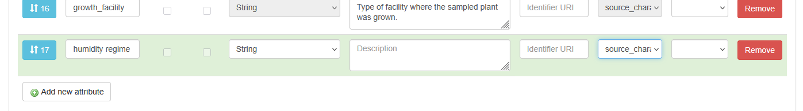

# Detailed instructions

!!! warning
    The catalogue is in testing phase. Any metadata uploaded in the catalogue is not yet backed up. This guide is still under development. 

## Phase 0

1. Understand the basic structure of the metadata model. 

2. Decide on the [what experiments to group into (the investigation and) the study](../../concepts/defining-a-study.md).

3. Choose the study type (sequencing, phenotyping or combined). Inform DataXR well up front when your study does not fit these types.

4. Make sure that you have registered your study in this [form](https://forms.office.com/Pages/ResponsePage.aspx?id=TVJuCSlpMECM04q0LeCIe9rk7LtjOclKu9pKlmXMf-xUMzVUVFpYVkxZTE9VNTFXTVBMSU1EN1paTC4u). After the admin has checked the registration, you will receive a study id you need when entering the metadata, as well as storage for your experimental data. 

5. Create an account for the [catalogue](https://catalogue.cropresilience.org) and log in.
    [Write about normal or KeyCloak?]

    Request to be added to a project. This is done by a project admin. 

6. Gather the files with the metadata that you already collected. This includes e-lab journal entries, files that outline experimental conditions per plant, files that link output files to the experiment, etc.

 
## Phase 1

1. Log in to the FairdomSEEK webpage.

2. Find or create an investigation.
      1. To find an investigation, click on “🔎Browse” (click the menu first when using a narrow window) in the top left corner and select “Investigations”.
      2. If your investigation is not yet registered, click on “➕Create” and select “Investigations”. Add a Title and select a Project and click on “Create”.

3. From within the investigation, create a new study by clicking “➕Design Study” at the top. 
      1. Create a tile using the naming convention.
      2. Choose the extended metadata type that is relevant for your study. 
   
         Of the extended metadata, only fill the mandatory fields for now (to be able to save). The other fields can still be entered later. Quickly skim the fields so you are aware of what is collected on study level.

      3. For now, skip the fields “Study position”, “Sharing”, “Creators”, “Publications”, and “Discussion Channels”. The fields “Sharing”, “Creators”, “Publications” can be reviewed and modified later.

      4. At “Define Sample type for Source”, select an “Existing template”. Choose the default template “CropXR source” and click “Apply”. Now review the predefined parameters that are collected for the study source. These are the fields that will be used to describe your experimental setup and conditions. If there are any missing, you can add them at the bottom by selecting “➕Add new attribute”. Make sure that the column “ISA Tag” is set to “source_characteristic”. Additional fields can also be added later.
       
         In MIAPPE there are many suggestions for [environmental parameters](https://github.com/MIAPPE/MIAPPE/blob/master/MIAPPE_Appendix_Environment.tsv) and [experimental factors](https://github.com/MIAPPE/MIAPPE/blob/master/MIAPPE_Appendix_Experimental_Factor.tsv) to collect. Please reference these lists, to get a predictable field name.

         Please do not remove any fields; this will make your study harder to find. All fields not relevant to your study can be left empty.

         

      5. Skip “SOPs” for now, these will be added later.

      6. At “Define Sample type for Sample” at select an “Existing template” you need to “Choose a template” in the drop down selection. Now select, depending on the units of measurement in your study: “CropXR sample” when there are samples only, “CropXR sample or observation unit” if there are both samples in your study as well as measurements on a different level, and “CropXR observation unit” when there are no samples. Choose the latest version of the template you need, and click “Apply”. Here you can also check the fields and add additional fields when needed, as describe for the source, while it is likely not needed.

      7. Click on “🟦Create”
 
4. Make a plan for how to define the Assay Streams and Assays. (read here)

5. Click on “➕Design Assay Stream” at the top of the study, enter a title (following the naming convention).

   If needed, select the “Extended metadata” for the assay stream. Skip all other fields for now and click on “🟦Create”.

6. From the created Assay Stream, create an assay by clicking “➕Design Assay”
      1. Enter a title (following the naming convention)
      2. For now skip the fields “Sharing”, “Creators”, “SOPs”, “Publications”, “Documents” and “Channel discussions”. 
      3. At “Define Sample type for Assay” start at the “Existing Templates”. Depending on the type of assay you are making (based on the plan made in step 4), change the “ISA Level” drop down to “assay - data file” or leave it as is. Choose the latest version of the relevant template in the drop down menu and “Apply”. 
      4. The sample type can be expanded with additional columns that should be included as metadata. This is relevant for assays where most parameters are kept constant, but some are varied between measurements/samples. If the fields is related to the assay performed, the column “ISA Tag” should be set to “parameter_value”, if it is about the output data file set it to “data_file_characteristic”. 
7. If needed (not included already in the assay), create the next assay of the type data file for the raw data. 
8. If needed, create the next assay of the type data file for the derived data.

Now you have the outline of your metadata structure. The actual metadata can be uploaded.

## Phase 2

Not all steps need to happen in this exact order, but some steps are dependent on each other: study sources need to be created before study samples and study samples before assay row entries. Data files need to be registered before they can be referenced.

1. Register your data files
      1. At the top menu under “➕Create” choose “Data file” 
      2. Choose how you want to [register your data](#registering-data-files). Find the URL at the data location (Research Drive).
      3. Under the tab “Remote URL” past the URL of the data location and “🟦Register”. Do not mind a warning about the URL in a yellow box. If there is an error and the URL cannot be registered please check if the URL is correct. 
      4. Fill in a “Title”, a “Description”, select a “Project”, click “🟦Next, and “🟦Next” 
      5. Select a license. The license can be adapted later if needed. At no license the consortium agreement applies to all people users that this data is shared with. 
      6. Adapt the sharing of the data, either on group level or per group. At a later stage, the permissions set here automatically apply to where the data is stored. For now, that is still handled separately in the research drive. 
      7. Skip “Associated Assays” and “Other associated items”by clicking “🟦Next, and “🟦Create”

2. Add SOPs (Standard operating procedure) (can also be done later).
    Each step can reference a protocol that was used: creation of samples and the grouping of observation units at the study level, the assaying protocols at assay level and the data transformation steps.
      1. At the top menu under “➕Create” choose “SOP”
      2. Click “Browse” to upload a local file.
      3. Add a “Title”. This needs to be specific enough to find the SOP back between other SOPs from different studies.
      4. Add a “Description”, select a “Project” and a “License”. Skip “Discussion Channels”, adapt “Sharing”, skip “Creators”, “Tags” and “Attributions”
      5. If the SOP is related to an assay, it can be linked under “Experimental assays and Modelling analyses”. This can also be done at the assay. 
      6. If a data processing step is described by a registered workflow/processing pipeline, it can be linked under “Workflows”. 
      7. Click “🟦Register”

3. Edit the study by going to “⚙️Actions” in the top corner and then “📝Edit ISA Study”
      1. Fill in the description
      2. Fill in extended metadata. Focus on the fields most relevant to understand the study. Skip the fields that do not apply. The fields can always be revised later. 
      3. Under “SOPs” select the SOP(s) that describe the sampling and the experimental design map. 
      4. Click “🟦Update” to apply the changes.

4. Define study source samples
      1. Choose [how to group/define the sources](#study-source).
      2. Go to the “Sources table”, by clicking the tab “Study design” (or from the “Single page” view find the “Sources table” in the left menu). Here you find a table with the columns that you have defined. 
      3. Download the template by clicking the button “Batch download to Excel”. 
      4. In the excel, under the Samples tab fill in the data in the fields. 
         1. Ignore the first two columns.
         2. The Source Name is the name that will be displayed.
         3. Start with the most relevant fields to understand the study and the sources used. The data can be improved on at a later point. Fill in at least the species and the experimental group. 
      5. Save the file. Upload it by under “Upload excel spreadsheet” select “Browse” and click “🟦Upload”. Now there might be an error message. Please read it carefully and adjust the data accordingly.
           
         Be aware, if you upload the same excel multiple times, a new sample will be created with the same name. To check how to update existing samples, check the phase 3 instructions.

5. Define study samples
      1. [Choose what type are needed](#study-samples).
      2. Go to “Samples table” under “Study design”(or from the “Single page” view find the “Samples table” in the left menu).
      3. Download the template by clicking the button “Batch download to Excel”.
      4. In the excel, under the Samples tab fill in the data in the fields. 
         1. Ignore the first two columns.
         2. Use the Input column to [link to a source](#sample-inputs) defined in the previous step.
         3. The subject_id is the name that will be displayed.
         4. There is a mandatory column called protocol. The text should refer to a registered SOP.
         5. Start with the most relevant fields. The data can be improved on at a later point. 
      5. Save the file. Upload it by under “Upload excel spreadsheet” select “Browse” and click “🟦Upload”. Now there might be an error message. Please read it carefully and adjust the data accordingly.

6. Fill in the assay stream extended metadata by going to  “⚙️Actions” in the top corner and then “📝Edit Assay Stream”. Focus on the fields that are most important and “🟦Update” to save.

7. For each assay defined in phase 1, enter the row data, the same way as the study source and sample: download the template, fill in the data, save and upload the template.
      1. For the first assay of an assay stream the input should be a study sample (so this is a sample of observation unit). For additional assays the input is an output of the previous assay. 
      2. To link a registered data file as file location, use the [required format](#data-files).
      3. For the file name, use the relative path of the exact file inside the registered file location. 

## Phase 3

1. Update the sharing permissions that each of the created elements have. Think about who should see your study. If you are collaborating with others you can give them edit permission. 
    You can edit them by navigating to the Study/Assay/DataFile/SOP, clicking “⚙️Actions” in the top corner and then “🔧Manage ..” After making the changes make sure to “🟦Update”
    
   Note that in the future the permission you set in SEEK on the data file will be automatically set where the data is stored, but for now the permission is still set separately within the Research Drive.

2. Update the study and assay extended metadata to make the metadata more complete (under “ “⚙️Actions” in the top corner and then “📝Edit ..”)

3. Updating existing samples [todo: expand]
      1. make sure it’s selected before downloaded, so there is no new sample with the same name
      2. You can upload multiple in multiple steps, but be aware that if you re-upload samples with the same name, a new sample will be created. Only upload new samples.

4. Adding additional columns  [todo: expand] (under “ “⚙️Actions” in the top corner and then “📝Edit ..”)

 