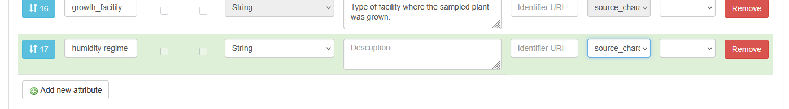
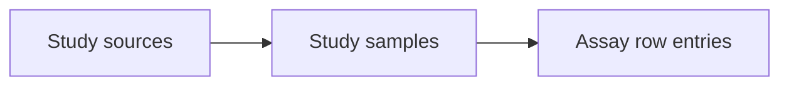
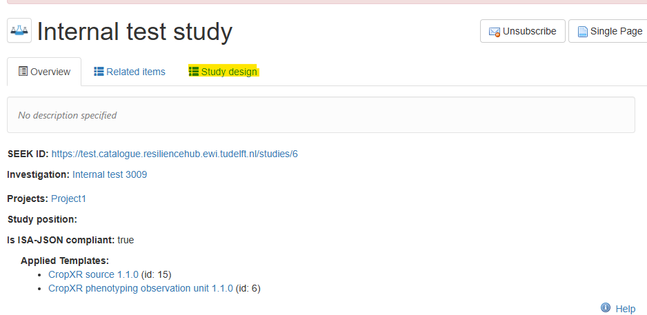
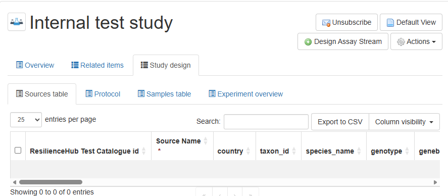

# Detailed instructions

Setting up a study happens in four phases. Work through them in order.

| Phase | What you do |
|---|---|
| [Phase 0](#phase-0-get-your-investigation-and-study-ids) | Get your investigation and study IDs |
| [Phase 1](#phase-1-create-the-template) | Create the template |
| [Phase 2](#phase-2-enter-the-metadata-then-add-the-data) | Enter the metadata |
| [Phase 3](#phase-3-refine-and-share) | Update permissions and complete the metadata |

---

## Phase 0: Get your investigation and study IDs

1. **Understand the basic structure of the metadata model.**

2. **Decide what to group together.** Decide on [what experiments to group into (the investigation and) the study](../../concepts/defining-a-study.md).

3. **Choose the study type:** sequencing, phenotyping or combined.

    !!! info
        Inform DataXR well up front when your study does not fit these types.

4. **Register your study.** Make sure that you have registered your study in this [form](https://forms.office.com/Pages/ResponsePage.aspx?id=TVJuCSlpMECM04q0LeCIe9rk7LtjOclKu9pKlmXMf-xUMzVUVFpYVkxZTE9VNTFXTVBMSU1EN1paTC4u). After the admin has checked the registration, you will receive a study ID, which you need when entering the metadata.

5. **Make sure you have an active account.** We use FairdomSEEK as the data catalogue, try to login with the following steps. 
    1. Select **Login** in the top right corner.
    2. Under the tab **KeyCloak**, click **🔒 Sign in with KeyCloak**.
    3. Click **SURFContext** to use your university account.
    4. For the first login, give the needed permissions.

6. **Request to be added to a project** if you have not been added already. This is done by a project admin.

7. **Gather the files with the metadata that you already collected.** This includes:

    - e-lab journal entries
    - files that outline experimental conditions per plant
    - files that link output files to the experiment
    - etc.

---

## Phase 1: Create the template

!!! warning "Always select the highest ID"
    This phase asks you to choose a template four times: for the study source, for the study
    sample or observation unit, and for each assay. Every one of those lists shows **every
    version of the template that has been released, all under the same name**. Nothing in the
    name tells the versions apart. The ID does: the highest ID is the most recent version.

    Whenever the selection tool offers more than one entry with the same name, select the one
    with the highest ID. A lower one gives your study an outdated set of fields, and the
    template of a sample type cannot be changed once samples have been created from it.

### Step 1: Log in

Log in to the [Catalogue webpage](https://catalogue.cropresilience.org/).

### Step 2: Find or create an investigation

=== "Find an existing investigation"

    Click **🔎 Browse** in the top left corner and select **Investigations**.

    (Click the menu first when using a narrow window.)

=== "Create a new investigation"

    If your investigation is not yet registered:

    1. Click **➕ Create** and select **Investigations**.
    2. Add a **Title** and select a **Project**.
    3. Click **Create**.

### Step 3: Create a study

From **within the investigation**, create a new study by clicking **➕ Design Study** at the top.

1. **Title:** create a title using the naming convention.

2. **Extended metadata:** choose the extended metadata type that is relevant for your study.

      **Only fill the mandatory fields** for now (to be able to save). The other fields can still be entered later.

3. **Skip for now:** “Study position”, “Sharing”, “Creators”, “Publications” and “Discussion Channels”. These fields can be reviewed and modified later.

4. **Define Sample type for Source:**
    1. Select an **Existing template**.
    2. Choose the default template **CropXR source** — where the list holds several entries under that name, take the one with the **highest ID**.
    3. Click **Apply**.
    4. Review the predefined parameters that are collected for the study source. These are the fields that will be used to describe your experimental setup and conditions.
    5. If there are any missing, you can add them at the bottom by selecting **➕ Add new attribute**. Make sure that the column **ISA Tag** is set to `source_characteristic`. **Additional fields can also be added later**.

    

    !!! tip "Use MIAPPE field names"
        In MIAPPE there are many suggestions for [environmental parameters](https://github.com/MIAPPE/MIAPPE/blob/master/MIAPPE_Appendix_Environment.tsv) and [experimental factors](https://github.com/MIAPPE/MIAPPE/blob/master/MIAPPE_Appendix_Experimental_Factor.tsv) to collect. Please reference these lists, to get a predictable field name.

    !!! warning "Do not remove fields"
        Please do not remove any fields; this will make your study harder to find. All fields not relevant to your study can be left empty.

5. **SOPs:** **skip** for now, these will be added later.

6. **Define Sample type for Sample:**
    1. Select an **Existing template**.
    2. Under **Choose a template**, pick from the drop-down. Templates are named and grouped by stream, so pick the set matching your study. Select, depending on the units of measurement:

        | Your study has… | Template |
        |---|---|
        | samples only | CropXR sequencing sample |
        | both samples as well as measurements on a different level | CropXR combined sample |
        | no samples | CropXR phenotyping study |

    3. Take the entry with the **highest ID**, this is the latest version of that template, and click **Apply**.
    4. Check the fields and add additional fields when needed (now or later).

    

7. Click **🟦 Create**.

### Step 4: Plan your assay streams and assays

Make a plan for how to define the Assay Streams and Assays. ([read here](reference.md#defining-assays))

### Step 5: Create an assay stream

1. Click **➕ Design Assay Stream** at the top of the study.
2. Enter a title (following the naming convention).
3. If needed, select the **Extended metadata** for the assay stream.
4. Skip all other fields for now and click **🟦 Create**.

### Step 6: Create an assay

From the created Assay Stream, create an assay by clicking **➕ Design Assay**.

1. **Enter a title** (following the naming convention).
2. **Skip for now:** “Sharing”, “Creators”, “SOPs”, “Publications”, “Documents” and “Channel discussions”.
3. **Define Sample type for Assay:**
    1. Start at **Existing Templates**.
    2. Depending on the type of assay you are making (based on the plan made in step 4), change the **ISA Level** drop-down to “assay - data file” or leave it as is.
    3. In the drop-down menu choose the relevant template, taking the entry with the highest ID, and click **Apply**.
4. **Extra columns (optional):** the sample type can be expanded with additional columns that should be included as metadata. This is relevant for assays where most parameters are kept constant, but some are varied between measurements/samples. Set the **ISA Tag** column to:

    | If the field is about… | ISA Tag |
    |---|---|
    | the assay performed | `parameter_value` |
    | the output data file | `data_file_characteristic` |

### Step 7: Raw data assay (if needed)

If needed (not included already in the assay), create the next assay of the type data file for the raw data.

The assay templates follow the same grouping:

| ISA level | Templates |
|---|---|
| assay - material | CropXR sequencing assay, CropXR phenotyping assay, CropXR metabolomics assay |
| assay - data file | CropXR sequencing data file, CropXR phenotyping data file, CropXR metabolomics data file |

### Step 8: Derived data assay (if needed)

If needed, create the next assay of the type data file for the derived data.

!!! success "Phase 1 done"
    Now you have the outline of your metadata structure. The actual metadata can be uploaded.

---

## Phase 2: Enter the metadata

Enter the metadata first; adding the data is the second step. Not all steps need to happen in this exact order, but some steps are dependent on each other:

```mermaid
flowchart LR
    A["Study sources"] --> B["Study samples"] --> C["Assay row entries"]
```

!!! info "One table at a time"
    Work through those tables one at a time, downloading each only after the previous one has been uploaded. SEEK identifies rows by the id the catalogue generates, not by name, so the Input column that links a table to the one before it cannot be filled until those rows exist. Downloading every workbook up front leaves you with Input columns you have no ids for.

### Step 1: Add SOPs (can also be done later)

SOP = Standard operating procedure. Each step can reference a protocol that was used: creation of samples and the grouping of observation units at the study level, the assaying protocols at assay level and the data transformation steps.

1. At the top menu under **➕ Create** choose **SOP**.
2. Click **Browse** to upload a local file.
3. Add a **Title**. This needs to be specific enough to find the SOP back between other SOPs from different studies.
4. Add a **Description**, select a **Project** and a **License**.
5. Skip “Discussion Channels”, adapt “Sharing”, skip “Creators”, “Tags” and “Attributions”.
6. If the SOP is related to an assay, it can be linked under **Experimental assays and Modelling analyses**. This can also be done at the assay.
7. If a data processing step is described by a registered workflow/processing pipeline, it can be linked under **Workflows**.
8. Click **🟦 Register**.

### Step 2: Edit the study

Go to **⚙️ Actions** in the top corner and then **📝 Edit ISA Study**.

1. Fill in the description.
2. Fill in extended metadata. Focus on the fields most relevant to understand the study. Skip the fields that do not apply. The fields can always be revised later.
3. Under **SOPs** select the SOP(s) that describe the sampling and the experimental design map.
4. Click **🟦 Update** to apply the changes.

### Step 3: Define study source samples

1. Choose [how to group/define the sources](reference.md#study-source).
2. Go to the **Sources table** by clicking the tab **Study design**.
      { width="600" }

      You should now see a table with the columns you defined:

      { width="600"}

3. Download the template by clicking **Batch download to Excel**.
4. In the Excel, under the **Samples** tab, fill in the data:
    - **Ignore** the first two columns.
    - The **Source Name** is the name that will be displayed.
    - Start with the most relevant fields to understand the study and the sources used. The data can be improved on at a later point. Fill in at least the species and the experimental group.
5. Save the file. Upload it under **Upload excel spreadsheet**: select **Browse** and click **🟦 Upload**.

    Now there might be an error message. Please read it carefully and adjust the data accordingly.

!!! warning "Uploading twice creates duplicates"
    Be aware, if you upload the same excel multiple times, a new sample will be created with the same name. To check how to update existing samples, check the [phase 3 instructions](#phase-3-refine-and-share).

### Step 4: Define study samples

1. [Choose what type are needed](reference.md#study-samples).
2. Go to **Samples table** under **Study design**.
3. Download the template by clicking **Batch download to Excel**.
4. In the Excel, under the **Samples** tab, fill in the data in the fields:
    - **Ignore** the first two columns.
    - Use the **Input** column to [link to a source](reference.md#sample-inputs) defined in the previous step.
    - The **subject_id** is the name that will be displayed.
    - There is a mandatory column called **protocol**. The text should refer to a registered SOP.
    - Start with the most relevant fields. The data can be improved on at a later point.
5. Save the file. Upload it under **Upload excel spreadsheet**: select **Browse** and click **🟦 Upload**.

    Now there might be an error message. Please read it carefully and adjust the data accordingly.

### Step 5: Fill in the assay stream metadata

Go to **⚙️ Actions** in the top corner and then **📝 Edit Assay Stream**. Focus on the fields that are most important and click **🟦 Update** to save.

### Step 6: Enter the assay rows

For each assay defined in phase 1, enter the row data the same way as the study source and sample: download the template, fill in the data, save and upload the template.

- **Input:** for the first assay of an assay stream the input should be a study sample (so this is a sample of observation unit). For additional assays the input is an output of the previous assay.

!!! note "Leave the file location empty for now"
    That column takes a reference to a data file already registered in SEEK — not a path or a URL — so the file has to exist as a record before the cell can be filled. Registering and linking happen in the second step, below.

!!! success "Metadata done"
    The metadata now stands on its own. The data can be added now.

<!-- ### Step 8: Link the registered data files into the assay rows

1. **File location:** to link a registered data file as file location, use the [required format](reference.md#data-files). The id in it is the data file's own id, read from the end of its URL (`…/data_files/1`), not the id of any sample or assay row.
2. **File name:** use the relative path of the exact file inside the registered file location.
3. **Select the rows before downloading**, so that uploading revises them instead of creating a second set with the same names. -->

---

## Phase 3: Refine and share

### Step 1: Update sharing permissions

Update the sharing permissions that each of the created elements have. Think about who should see your study. If you are collaborating with others you can give them edit permission.

1. Navigate to the Study/Assay/DataFile/SOP.
2. Click **⚙️ Actions** in the top corner and then **🔧 Manage ..**
3. After making the changes, make sure to click **🟦 Update**.

!!! note
    In the future the permission you set in SEEK on the data file will be automatically set where the data is stored, but for now the permission is still set separately within the Research Drive.

### Step 2: Complete the metadata

Update the study and assay extended metadata to make the metadata more complete (under **⚙️ Actions** in the top corner and then **📝 Edit ..**).

### Step 3: Updating existing samples

[todo: expand]

- Make sure it's selected before downloaded, so there is no new sample with the same name.
- You can upload multiple in multiple steps, but be aware that if you re-upload samples with the same name, a new sample will be created. Only upload new samples.

### Step 4: Adding additional columns

[todo: expand] (under **⚙️ Actions** in the top corner and then **📝 Edit ..**)