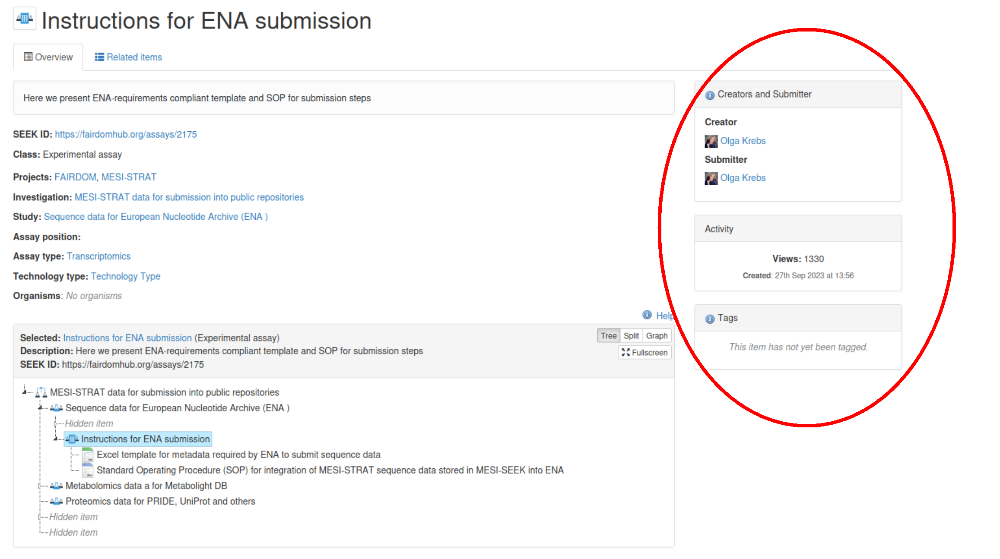

# Before Uploading a Dataset

This page covers what needs to be in place before you can upload a dataset and register it in FairdomSEEK (Metadata catalogue). It also covers how sharing
permissions work, and how to find data you are already entitled to access.

!!! note "This page assumes that an assay already exists in FairdomSEEK"
    If you're setting up a brand new study/assay, or defining the metadata structure for the
    first time, use the [Full Guide](full-guide.md) instead. This page is for uploading into an
    assay someone has already created.

## Are you ready to upload?

- [ ] You have an active FairdomSEEK account.
- [ ] You've been added to your Work Package's FairdomSEEK project.
- [ ] You have editing access to the FairdomSEEK assay you're uploading to.
- [ ] You know the assay's FairdomSEEK ID.

If any of these do not apply to you, the upcoming sections will guide you through how to get there. Otherwise, you're all ready to upload!

## 1. Get a FairdomSEEK account

1. Go to [FairdomSEEK](https://catalogue.cropresilience.org/) & select "Log in" at the
   top right corner.
2. Under the "KeyCloak" tab, click "Sign in with KeyCloak".
3. Click "SURFcontext" and sign in with your university account.
4. On first login, grant the requested permissions. Please contact data@cropxr.org if you are unable to login.

## 2. Confirm you've been added to your project

1. Whilst logged in, click on your name in the top-right corner.
2. Select "My profile".
3. Select "Related items".
4. Select the "Projects" item to display the projects that you are a member of.

Every CropXR Work Package maps to a single project in FairdomSEEK.

| FairdomSEEK project | Work Package |
|---|---|
| C1 | Work Package 1 |
| C2 | Work Package 2 |
| ... | ... |


Projects are visible to everyone, even if you have never joined one. You can browse projects by clicking the 'Browse' tab in the navigation bar, and selecting 'Projects'.

If you're not yet a member of your Work Package's project, you can request membership from the
project's page. 

Every project has a **Work Package Lead**, who acts as the Project Administrator and
approves join requests. If you do not know who your Work Package Lead is, please contact the DataXR team (data@cropxr.org).

Access to project studies, assays and data files is not automatically granted to project members. Access to such material must be shared separately
 (see [Permission levels](permissions-in-fairdomseek.md#permission-levels)).

## 3. Get edit access to the assay

Uploading requires **Editing** access on the assay itself, not just the study it belongs to, or
the investigation the study belongs to.

!!! warning "Access does not cascade"
    Having access to a study does not automatically give you access to its assays. Similarly, having access to an
    assay does not give you access to its data files. Each is shared independently, so please check
    permissions on the specific assay you intend to upload to.

If you don't have editing access, you must request edit permission from the creator/submitter of the assay, or the Work Package Lead. If you can't find the assay at all, it may be shared privately with people other than yourself (see [Finding data you're entitled to access](permissions-in-fairdomseek.md#finding-data-youre-entitled-to-access)).


The image below of an assay page shows where to find the creator/submitter.


If the assay doesn't exist yet, it needs to be created before you can upload. See the
[Full Guide](full-guide.md#phase-1-creating-the-template) for how to:

- Create the assay.
- Connect it to the correct study and investigation.
- Set-up its metadata skeleton (choosing the right templates).

## 4. Find the assay's FairdomSEEK ID

The FairdomSEEK ID is the number at the end of the assay's URL. Open the assay in FairdomSEEK and
read it off the address bar:

```
https://catalogue.cropresilience.org/assays/123
```

The same pattern applies to studies, investigations, and data files.
The ID is always the number at the end of that resource's URL.

## See also

- [Short Guide](short-guide.md) — quick reference for entering metadata once you're set up
- [Full Guide](full-guide.md) — detailed guide for creating studies and assays from scratch
- [Reference](reference.md) — formatting reference for the upload spreadsheets
